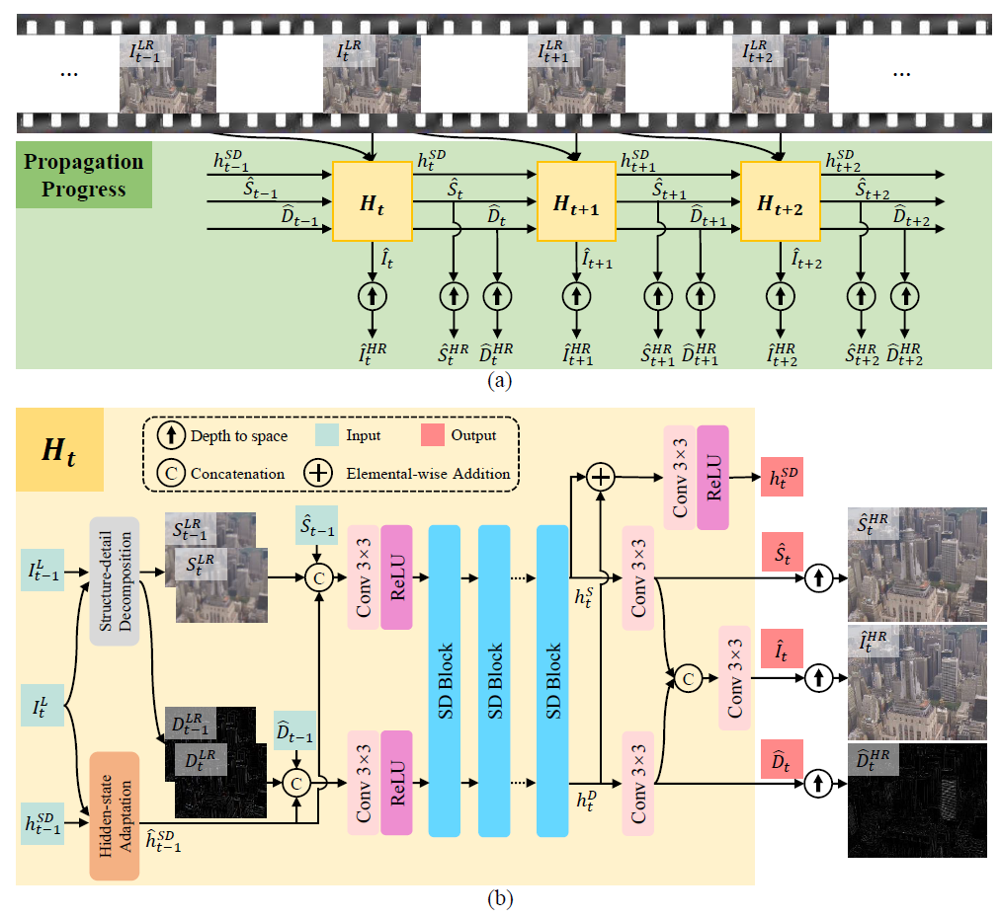

# Video Super-Resolution with Recurrent Structure-Detail Network (RSDN)

The *official* source code for the [Video Super-Resolution with Recurrent
Structure-Detail Network] which is accepted by [ECCV-2020].



### Train
We utilize 8 Nvidia Tesla V100 GPUs for training.
```
python main.py
```

### Test
We utilize 1 P100 GPU for testing.
Test the trained model with best performance by
```
python test.py
```
